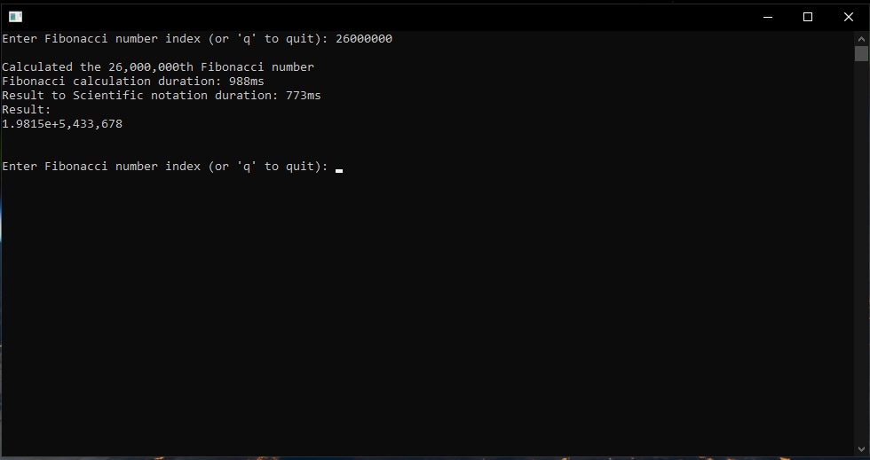

# Fibonacci Sequence Calculator
A high-performance CLI application written in Rust that can calculate any positive Nth number of the Fibonacci sequence.


<div align="center"><em>Screenshot of the CLI application finished calculating the 26 millionth Fibonacci number in 988 milliseconds (Ryzen 7 5800X3D @ 4.4GHz).</em></div>

## Usage
1. Clone this repository: 
```bash
git clone https://github.com/0DarkPhoenix/fibonacci_sequence.git
```

2. Navigate to the project directory and build the release version:
```
cargo build --release
```

3. Run the application: 
```
cargo run --release
```

4. When prompted, enter the index of the Fibonacci number you want to calculate
   - Enter a positive number to calculate that Fibonacci number
   - Enter 'q' to quit the application

## Output Information
The application will display:

- The calculated Fibonacci number
- Calculation duration
- Conversion duration (string or scientific notation)
- Results in standard or scientific notation (Result is converted to scientific notation if the number is larger than 10^35)

## Used Dependencies
- num-bigint: For handling arbitrary-precision integers
- rayon: For parallel computation
